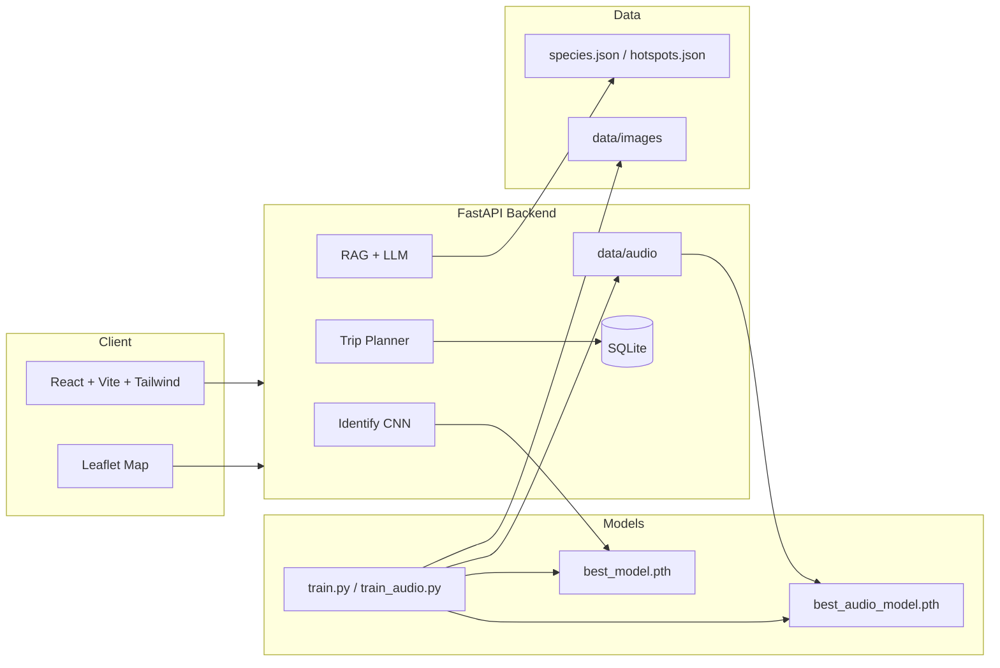

# WildTrail

> 사진·소리로 야생동물을 식별하고, 도감·관찰지·여행 일정까지 한 번에 — 생태 관광 MVP

[](backend/)
[](frontend/)
[](models/)

---

## 한 줄 소개

**WildTrail**은 촬영한 사진(또는 소리)으로 동물 종을 추정하고, RAG 도감 질의, Leaflet 관찰지 지도, 맞춤 여행 플래너를 제공하는 **교육·포트폴리오용 생태 관광 플랫폼**입니다.

---

## 스크린샷

> Git 저장소에는 UI 스크린샷이 포함되지 않습니다. 로컬 실행 후 `docs/images/`에 캡처를 추가하세요. (가이드: [docs/images/README.md](docs/images/README.md))

| 식별 | 도감 RAG | 관찰지 지도 | 여행 일정 |
|------|----------|-------------|-----------|
| *(로컬 캡처)* | *(로컬 캡처)* | *(로컬 캡처)* | *(로컬 캡처)* |

3분 발표 시나리오: **[docs/DEMO_SCRIPT.md](docs/DEMO_SCRIPT.md)**

---

## 주요 기능

| 기능 | 설명 |
|------|------|
| **이미지 식별** | EfficientNet-B0 CNN (모델 없으면 stub 데모) |
| **오디오 식별** | Mel 스펙트로그램 + ResNet18 (모델 없으면 분석+stub) |
| **도감 RAG** | TF-IDF 검색 + Gemini/OpenAI LLM 요약 (키 없으면 템플릿) |
| **관찰지 지도** | Leaflet + `hotspots.json` 핫스팟 |
| **여행 플래너** | 규칙 기반 일정·경비·경로 + LLM 요약 (선택) |
| **관찰 기록** | SQLite sightings 타임라인 |

---

## 아키텍처



상세: [docs/ARCHITECTURE.md](docs/ARCHITECTURE.md)

---

## 빠른 시작 (15분)

Windows PowerShell 기준. **모델 가중치·학습 데이터는 Git에 없습니다** — clone 직후에는 식별이 **stub(데모) 모드**입니다.

### 1. Backend (먼저 실행)

```powershell
cd backend
python -m venv .venv
.\.venv\Scripts\activate
pip install -r requirements.txt
copy .env.example .env
# .env에 GEMINI_API_KEY 등 설정 (아래 환경 변수 참고)
uvicorn app.main:app --reload --host 127.0.0.1 --port 8000
```

### 2. Frontend (새 터미널)

```powershell
cd frontend
npm install
npm run dev
```

> `npm run dev`는 백엔드(8000) 연결을 먼저 확인합니다. 백엔드가 없으면 실행 방법을 안내합니다.

### 3. 동작 확인

| URL | 기대 결과 |
|-----|-----------|
| http://localhost:5173 | WildTrail UI |
| http://127.0.0.1:8000/health | `image_model`, `audio_model`, `llm_provider` 등 |
| http://127.0.0.1:8000/docs | Swagger API |

```powershell
Invoke-RestMethod http://127.0.0.1:8000/health | ConvertTo-Json -Depth 5
```

### 4. (선택) 학습 모델 연결

`models/checkpoints/`에 checkpoint를 배치하거나 직접 학습한 뒤 `backend/.env`:

```env
MODEL_PATH=../models/checkpoints/best_model.pth
```

백엔드 재시작 → `/health`에서 `image_model.model_loaded`, `audio_model.model_loaded` 확인.  
식별 결과 `source: "model"`이면 AI 모드입니다.

### 포트 충돌 시

```powershell
netstat -ano | findstr :8000
# PID 종료 후 uvicorn 재시작
```

---

## Git에 없는 것 (clone 후 별도 준비)

| 항목 | 경로 | 용도 |
|------|------|------|
| 학습 이미지 | `data/images/` | CNN 학습·식별 |
| 오디오 데이터 | `data/audio/` | 오디오 CNN 학습 |
| 모델 가중치 | `models/checkpoints/*.pth` | 이미지·오디오 식별 |
| LLM API 키 | `backend/.env` | 도감 RAG·여행 LLM |
| UI 스크린샷 | `docs/images/` | README·발표 |

---

## What Works / What Doesn't

| 기능 | clone 직후 | checkpoint 배치 후 | `GEMINI_API_KEY` 후 |
|------|------------|-------------------|---------------------|
| 이미지 식별 | stub (데모) | **AI 모델** | AI 모델 |
| 오디오 식별 | 분석 + stub | **AI 모델** (학습 시) | AI 모델 |
| 도감 조회 | ✅ | ✅ | ✅ |
| RAG Q&A | 템플릿 | 템플릿 | **LLM** (`llm+rag`) |
| 여행 플래너 | 규칙 엔진 | 규칙 엔진 | LLM 요약 |
| 관찰지 지도 | ✅ | ✅ | ✅ |
| 관찰 기록 | ✅ | ✅ | ✅ |

---

## 환경 변수

`backend/.env.example` → `.env` 복사:

| 변수 | 필수 | 설명 |
|------|------|------|
| `DATABASE_URL` | | SQLite 경로 (기본 `sqlite:///./wildtrail.db`) |
| `MODEL_PATH` | | 이미지 모델 checkpoint |
| `LLM_PROVIDER` | | `gemini`(기본) 또는 `openai` |
| `GEMINI_API_KEY` | 선택 | Google AI Studio 키 (RAG·여행 LLM) |
| `GEMINI_MODEL` | | 기본 `gemini-2.5-flash-lite` |
| `OPENAI_API_KEY` | 선택 | `LLM_PROVIDER=openai`일 때 |
| `OPENAI_MODEL` | | 기본 `gpt-4o-mini` |
| `CORS_ORIGINS` | | 프론트 URL |
| `MAX_IMAGE_MB` / `MAX_AUDIO_MB` / `MAX_VIDEO_MB` | | 업로드 제한 |

오디오 모델은 `MODEL_PATH`와 **같은 폴더**의 `best_audio_model.pth`를 자동 로드합니다.

---

## API 예시

```powershell
# 도감 목록
Invoke-RestMethod http://127.0.0.1:8000/api/v1/species

# 이미지 식별 (PowerShell 7+)
$form = @{ file = Get-Item ".\sample.jpg" }
Invoke-RestMethod http://127.0.0.1:8000/api/v1/identify/image -Method Post -Form $form

# 도감 RAG 질문
$body = @{ question = "어디서 보면 좋나요?"; species_id = "pica_pica" } | ConvertTo-Json
Invoke-RestMethod http://127.0.0.1:8000/api/v1/encyclopedia/ask -Method Post -Body $body -ContentType "application/json"

# 여행 일정
$body = @{
  species_id = "grus_japonensis"
  origin = "서울"
  days = 2
  travelers = 2
  budget_krw = 300000
  preferences = @{ transport = "public"; accommodation = "guesthouse" }
} | ConvertTo-Json -Depth 5
Invoke-RestMethod http://127.0.0.1:8000/api/v1/trips/plan -Method Post -Body $body -ContentType "application/json"
```

---

## 학습 데이터 준비 & 모델 학습

ML 스크립트는 **`backend/.venv` Python**으로 실행합니다 (`models/ml.ps1` 래퍼 권장).

### 이미지

```powershell
cd models
.\ml.ps1 prepare_dataset.py split --raw-dir ../data/images/raw --out-dir ../data/images --copy
.\ml.ps1 validate_coverage.py --strict
.\ml.ps1 train.py --data-dir ../data/images --epochs 15
.\ml.ps1 evaluate.py --output ../reports
.\ml.ps1 stamp_checkpoint.py
```

### 오디오

```powershell
cd models
.\ml.ps1 split_audio.py --data-dir ..\data\audio --clear-val
.\ml.ps1 train_audio.py --data-dir ..\data\audio --epochs 20
```

| 문서 | 내용 |
|------|------|
| [models/README.md](models/README.md) | ML 스크립트·`ml.ps1` 사용법 |
| [DATA_COLLECTION_GUIDE.md](docs/DATA_COLLECTION_GUIDE.md) | 이미지 수집 |
| [HARD_NEGATIVE_GUIDE.md](docs/HARD_NEGATIVE_GUIDE.md) | 유사 종 보강 |
| [ML_EVAL_REPORT.md](docs/ML_EVAL_REPORT.md) | 평가·오분류 분석 |

---

## 현재 한계 (Known Limitations)

- **식별 종 수:** `species.json` **31종** — 이미지 모델 **30종**, 오디오 모델 **31종** (로컬 학습 기준, checkpoint에 따라 다름)
- **이미지 정확도:** 통일 전처리 evaluate **~83.6%** (30종, 로컬 최신 학습 기준 — [ML_EVAL_REPORT.md](docs/ML_EVAL_REPORT.md) 참고)
- **오디오 정확도:** ResNet18 val **~52%** (과적합·데이터 불균형 개선 여지)
- **LLM:** Gemini/OpenAI 키·할당량 필요 (`/health`의 `llm_configured` 확인)
- **공공 API:** 일부 지역정보·날씨는 스텁 응답
- **동기 추론:** PyTorch 추론이 API 스레드에서 동기 실행 (MVP 수준)

---

## 프로젝트 구조

```
WildTrail/
├── backend/          # FastAPI, SQLite, RAG, LLM, 식별 서비스
├── frontend/         # React + Vite + Tailwind + Leaflet
├── data/             # species.json, hotspots.json, images/, audio/
├── models/           # train.py, train_audio.py, split_audio.py, ml.ps1
├── reports/          # ML 평가 산출물 (로컬 생성)
└── docs/             # 아키텍처, 수집·데모 가이드
```

---

## 로드맵

- [x] P0: DB 시드 upsert, `/health`, 업로드 검증, 로깅
- [x] P1: evaluate.py, 오분류 분석, 전처리 정합성, 커버리지 검증
- [x] LLM: Gemini 어댑터 (`LLM_PROVIDER`), RAG·여행 플래너 연동
- [x] 오디오: `split_audio.py`, `train_audio.py`, Mel+ResNet18 파이프라인
- [ ] hard negative 수집 후 이미지 재학습 (까치/어치·노루/고라니 등)
- [ ] 오디오 데이터 보강·val acc 개선
- [ ] 영상 YOLO 파이프라인
- [ ] PostGIS 거리 기반 핫스팟 정렬

---

## 문서 목록

| 문서 | 설명 |
|------|------|
| [DEMO_SCRIPT.md](docs/DEMO_SCRIPT.md) | 3분 발표 시나리오 |
| [ARCHITECTURE.md](docs/ARCHITECTURE.md) | 시스템 설계 |
| [MIGRATION.md](docs/MIGRATION.md) | DB 시드 마이그레이션 |
| [PREPROCESS_ALIGNMENT.md](docs/PREPROCESS_ALIGNMENT.md) | 학습/추론 전처리 |
| [CONTRIBUTING.md](CONTRIBUTING.md) | 기여 가이드 |

---

## 라이선스 & 데이터 출처

- **코드:** [MIT License](LICENSE)
- **이미지·오디오 데이터:** 직접 촬영·Xeno-canto·AI Hub 등 — 출처·라이선스 기록 권장 ([수집 가이드](docs/DATA_COLLECTION_GUIDE.md))
- **멸종위기·보호종:** 관찰 거리·보호구역 규정 준수. 출현은 보장되지 않습니다.

---

## 기여

이슈·PR 환영합니다. [CONTRIBUTING.md](CONTRIBUTING.md)를 참고하세요.
